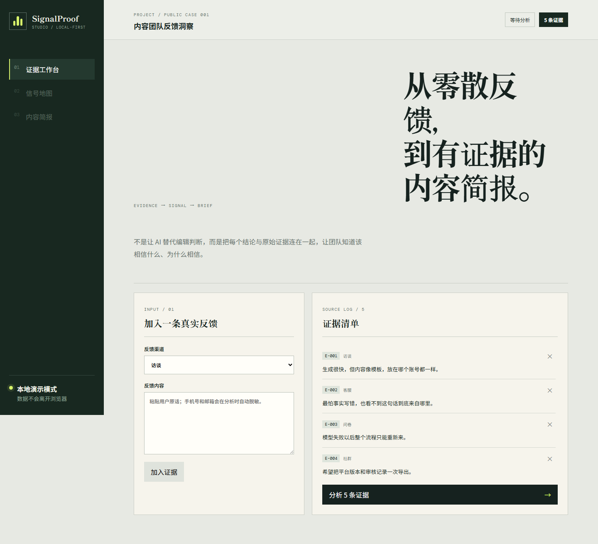
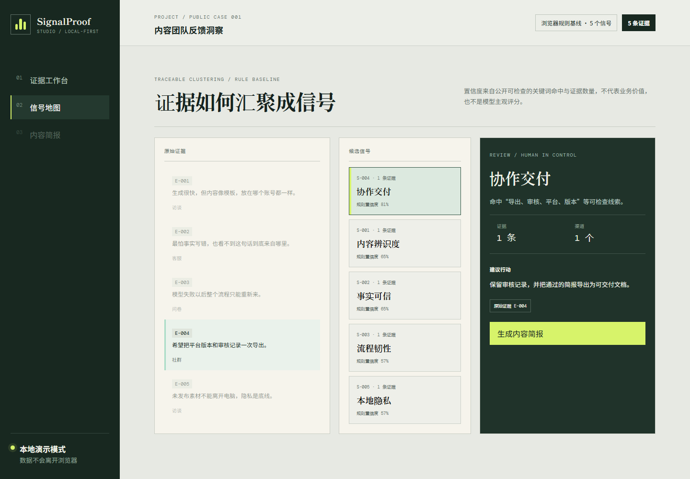
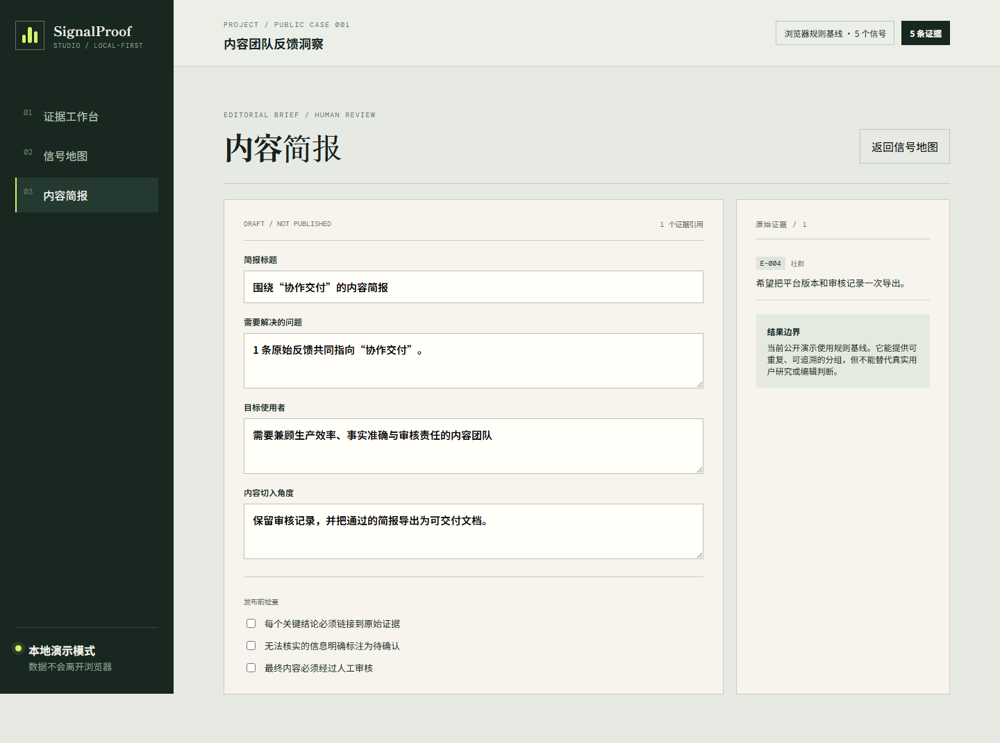
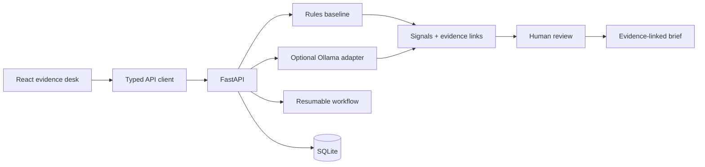

# SignalProof Studio

> 把零散反馈转化为有来源、可复核、可执行的内容简报。

[在线体验](https://a2740637809-rgb.github.io/contentproof-ai/) · [公开案例](docs/case-study.md) · [评测方法](docs/evaluation.md) · [架构说明](docs/architecture.md)

SignalProof 面向媒体编辑、品牌内容运营和内容策划人员。它不让 AI
直接替代编辑，而是把每个候选信号与原始反馈连接起来，让人能够检查、
修改和最终决定哪些信息进入内容 Brief。



| 可解释信号地图 | 带证据的内容 Brief |
|---|---|
|  |  |

## 为什么做

内容团队通常从访谈、客服、问卷、评论和社群中收集反馈。真正困难的
不是“再生成一篇稿件”，而是：

- 同一个问题可能有很多不同说法；
- 结论容易脱离原始语境；
- 编辑无法判断 AI 为什么这样归类；
- 模型失败后已经完成的步骤可能丢失；
- 未发布素材不适合默认上传到第三方服务。

SignalProof 将工作收敛为一条可解释链路：

```text
原始证据 → 脱敏与校验 → 候选信号 → 人工复核 → 内容 Brief → 导出
```

## 现在可以真实完成什么

- 在公开演示中新增、删除和分析反馈；
- 使用可重复的浏览器规则基线生成候选信号；
- 查看规则命中理由、置信度和每条原始证据；
- 从选中信号生成可编辑 Brief；
- 在本地后端持久化任务、来源、工作流步骤、评测与人工审核；
- Ollama 可用时执行结构化本地模型工作流；
- 模型不可用时保留确定性规则模式，而不是伪造模型结果；
- 运行 50 条分层样本的可复现基准，并公开全部失败案例。

## 一分钟体验

1. 在“证据工作台”输入一条真实反馈；
2. 点击“加入证据”；
3. 点击“分析”；
4. 选择候选信号，观察左侧证据高亮；
5. 点击“生成内容简报”并人工修改。

公开页面明确标注为**浏览器规则基线**。其中的置信度只表示关键词命中
与证据数量，不代表业务价值，也不是未经验证的模型评分。

## 架构



| 层 | 责任 |
|---|---|
| React/Vite | 证据录入、信号检查、Brief 编辑和公开可用的规则演示 |
| FastAPI | 项目数据、运行状态、评测、审核和导出 API |
| SQLAlchemy/SQLite | 本地持久化与可恢复步骤 |
| 规则基线 | 稳定、便宜、可解释的最低能力 |
| Ollama | 可选的本地结构化生成，不是产品可用性的前提 |
| Evaluation runner | 分标签质量、失败样本和回归检查 |

## 可复现评测

`data/evaluation/signalproof-v1.jsonl` 包含 50 条仓库自建合成样本，覆盖
五个主题与多个难度等级。它不包含客户私有数据，也不代表真实生产分布。

当前确定性关键词基线：

| 指标 | v0.2 基线 |
|---|---:|
| 样本数 | 50 |
| 分类准确率 | 0.84 |
| Macro F1 | 0.7425 |
| 公开失败案例 | 8 |

运行：

```powershell
py -3.12 scripts/run_benchmark.py
```

结果写入 `data/evaluation/baseline-report.json`，其中包含每个标签的
precision、recall、F1 和所有误判。项目刻意保留失败案例，避免用一个
漂亮的综合分掩盖规则基线的边界。

## 本地启动

### 1. 后端

要求 Python 3.11+。

```powershell
cd backend
py -3.12 -m pip install -e ".[dev]"
py -3.12 -m uvicorn app.main:app --reload
```

API 文档：`http://127.0.0.1:8000/docs`

### 2. 前端

```powershell
cd frontend
npm install
npm run dev
```

页面：`http://127.0.0.1:5173`

### 3. 可选 Ollama

```powershell
ollama pull qwen2.5:7b
ollama serve
```

复制 `.env.example` 为 `.env` 后可修改模型地址和模型名。公开静态演示
不依赖 Ollama。

## 验证

```powershell
cd backend
py -3.12 -m pytest -q

cd ..\frontend
npm test -- --run
npm run build
```

## 数据与隐私

- 公开演示的分析发生在浏览器中；
- 规则分析会脱敏中国大陆手机号和常见邮箱格式；
- 本地 API 默认使用 SQLite；
- 仓库示例为合成或公开可引用的短摘要；
- 不应将敏感素材放入公开演示或提交到 Git。

这不是完整的数据防泄漏系统。生产使用前仍需补充认证、授权、密钥管理、
审计保留策略和组织级安全评审。

## 已知限制

- 当前规则基线依赖有限词表，难以处理隐喻、否定和多意图反馈；
- 50 条合成样本只能用于早期回归，不能证明真实用户效果；
- 公开 GitHub Pages 是浏览器演示，本地后端能力需要自行启动；
- 用户访谈和真实任务验证尚未完成，不宣称效率提升或团队采用；
- Ollama 输出仍需要结构校验和人工终审。

## 路线图

- [x] 可操作的证据到 Brief 公开演示
- [x] 50 条分层评测集与失败报告
- [x] 持久化任务与可恢复模型工作流
- [ ] 向量语义基线与规则基线对照
- [ ] 信号合并、拆分、驳回的完整审核日志
- [ ] 3–5 位内容从业者的任务测试
- [ ] 认证、权限和更完整的隐私威胁模型

## AI 工具与个人贡献边界

本项目使用 AI 编程工具辅助脚手架、局部实现、测试和文档整理。产品问题
定义、用户范围、证据链设计、评测标准、验收门槛和最终取舍需要由项目
负责人理解并承担。任何无法通过代码、数据、测试或研究记录证明的结果，
都不会写成项目成效。

## License

[MIT](LICENSE)
