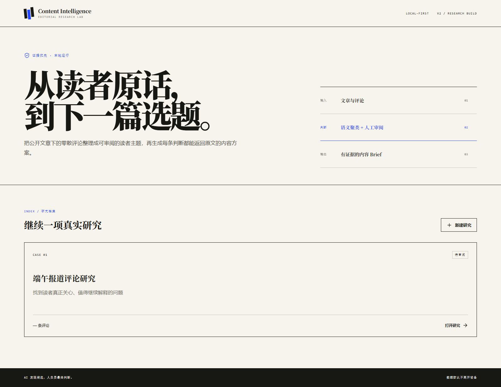
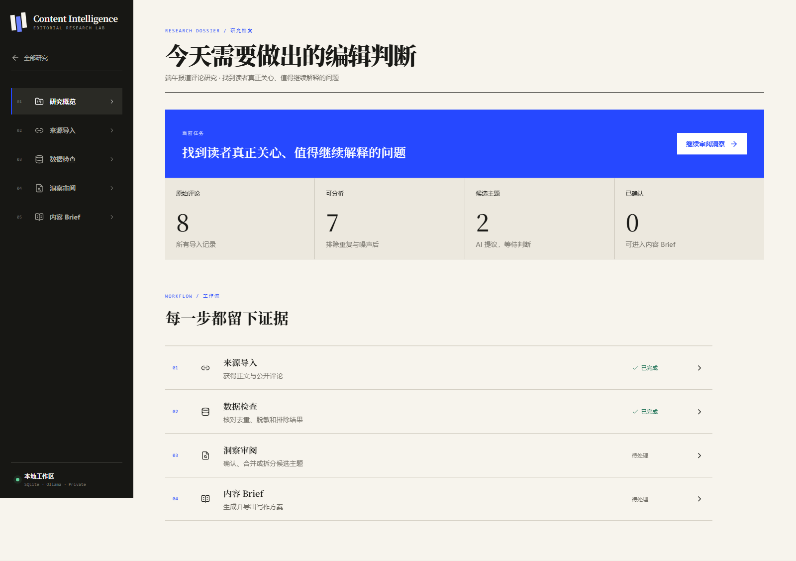
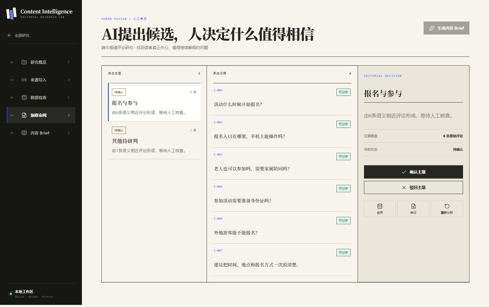
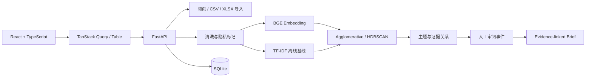

# Content Intelligence Lab

> 从读者原话，到下一篇选题。

一个本地优先、证据优先的 AI 内容研究工作台：把公开文章、评论与用户反馈整理成可审阅的读者主题，再生成每条判断都能返回原文的内容 Brief。



| 研究概览 | 证据审阅台 |
|---|---|
|  |  |

## 它解决什么问题

内容团队并不缺“再写一篇稿”的工具，真正困难的是：

- 几百条评论中，读者反复追问的到底是什么；
- AI 给出的主题是否能回到真实原话，而不是凭空总结；
- 哪些内容是广告、重复项或包含个人信息；
- 编辑如何合并、拆分、驳回主题并保留判断过程；
- 分析失败或模型离线时，已经完成的工作是否还能继续。

项目把这件事做成一条可追溯工作流：

```text
文章 / 评论
    ↓
来源回执（正文与评论分别报告）
    ↓
清洗、去重、脱敏与人工恢复
    ↓
本地向量化与聚类
    ↓
证据审阅：确认 / 驳回 / 合并 / 拆分
    ↓
带原始评论编号的内容 Brief
    ↓
Markdown / Word 导出
```

## 不是另一个“AI 写作 Demo”

| 常见 Demo | Content Intelligence Lab |
|---|---|
| 输入一句话，生成一段答案 | 导入真实来源，保留来源回执 |
| AI 直接给结论 | 每个主题连接原始评论 |
| 一个“综合评分” | 具体状态、证据数量与人工决定 |
| 模型报错就中断 | 本地离线基线继续完成流程 |
| 漂亮但无效的按钮 | 所有主操作连接真实 API 与数据库 |
| 输出只能复制 | 可编辑 Brief，并导出 Markdown / Word |

## 核心能力

### 1. 三种真实数据入口

- **公开网页**：用 `trafilatura` 提取正文；正文和评论状态分别报告，不把“没有评论”伪装成成功。
- **粘贴评论**：一行一条，适合少量访谈或社群反馈。
- **CSV / XLSX**：拖放上传，使用 `react-dropzone` 处理文件交互。

系统保留原始文本和清洗文本，自动标记手机号、邮箱、广告与重复内容。被排除的评论可以恢复。

### 2. 可降级的本地分析

优先路径：

```text
BAAI/bge-small-zh-v1.5
→ 归一化 Embedding
→ 小数据 Agglomerative Clustering
→ 大数据 HDBSCAN
```

首次运行时需要下载 BGE 模型。如果模型未下载或网络不可用，系统会使用本地字符 TF‑IDF 向量作为离线基线，并在 `embedding_model` 与 `clustering_method` 中明确标注 `offline-fallback`，不会冒充 BGE 结果。

### 3. Human-in-the-loop 证据审阅

`Human-in-the-loop` 指“AI 先给候选，人做最终判断”。编辑可以：

- 查看主题对应的全部原始评论；
- 修改主题名称并持久化；
- 确认或驳回候选主题；
- 合并两个主题；
- 从一个主题中选择评论并拆出新主题；
- 重新运行分析；
- 查看后端保存的审阅事件。

### 4. 带证据的内容 Brief

只有被人工确认的主题才能进入 Brief。输出包括：

- 建议选题；
- 目标读者；
- 需要解决的问题；
- 内容角度与文章结构；
- 发布前风险检查；
- 证据评论编号；
- Markdown 与 Word 文件。

评论只能证明“读者提出了什么问题”，不能替代事实核验——这条边界会直接显示在界面与导出文件中。

## 产品与界面

视觉不是套用后台模板，而是围绕“编辑研究档案”建立的原创设计系统：

- 暖白纸张、黑色档案柜、钴蓝决策色；
- 大字号编辑式标题与高密度证据表格；
- 首页、项目概览、来源导入、数据检查、证据审阅、Brief 六类场景；
- 移动端导航、键盘焦点、减少动画模式与空状态；
- 页面切换使用 Motion，表格使用 TanStack Table，服务状态使用 TanStack Query。

设计参考和取舍记录见 [V2 产品规格](docs/superpowers/specs/2026-07-27-content-intelligence-lab-v2-design.md)。

## 技术架构



| 层 | 主要技术 | 职责 |
|---|---|---|
| 前端 | React、TypeScript、Vite | 研究流程与编辑交互 |
| 数据状态 | TanStack Query、TanStack Table | API 缓存与评论表格 |
| 交互 | Motion、react-dropzone、Lucide | 过渡、上传与图标系统 |
| 后端 | FastAPI、Pydantic | 类型化 API 与业务规则 |
| 数据库 | SQLAlchemy、SQLite | 项目、来源、评论、运行、主题、审阅、Brief |
| 文本分析 | Sentence Transformers、scikit-learn、HDBSCAN | 向量化与主题聚类 |
| 内容提取 | trafilatura、openpyxl | 网页、CSV 与 XLSX |
| 导出 | python-docx | Markdown 与 Word |

## 数据模型

```text
ResearchProject
├── ResearchSource
├── ResearchComment
│   └── CommentEmbedding
├── AnalysisRunV2
│   └── ResearchTheme
│       └── ThemeMembership → ResearchComment
├── ReviewEvent
└── ResearchBrief
```

分析运行与主题分开保存，因此重新分析不会覆盖历史运行；界面只显示最近一次完成的主题集合。Embedding 以“评论 + 模型”做唯一缓存，重复运行不会插入重复向量。

## 本地启动

### 环境

- Python 3.11+
- Node.js 20+
- 约 2 GB 可用磁盘空间（首次下载本地 Embedding 模型时）

### 后端

```powershell
cd backend
py -3.12 -m pip install -e ".[dev]"
py -3.12 -m uvicorn app.main:app --reload
```

API 文档：`http://127.0.0.1:8000/docs`

### 前端

```powershell
cd frontend
npm install
npm run dev
```

页面：`http://localhost:5173`

### 最短体验路径

1. 点击“新建研究”，写下这次要解决的问题；
2. 在“来源导入”粘贴 6 条以上真实评论；
3. 在“数据检查”核对排除项；
4. 在“洞察审阅”运行分析并查看原始证据；
5. 确认至少一个主题；
6. 生成内容 Brief 并导出 Word。

## 验证

```powershell
cd backend
py -3.12 -m pytest -q

cd ..\frontend
npm test -- --run
npm run build
npm audit --omit=dev
```

浏览器验收脚本会建立本地案例、遍历关键页面、保存截图并检查控制台错误：

```powershell
py -3.12 frontend/e2e/visual_review.py
```

## 真实性与边界

- 仓库示例评论是用于演示流程的合成数据，不冒充真实用户调研；
- 网页导入只处理公开可访问内容，平台未开放的评论需要手动导入；
- 首次 BGE 模型下载依赖 Hugging Face 网络；失败时会明确使用离线基线；
- 项目没有宣称“效率提升 80%”或“已服务某公司”等未经验证的结果；
- 本地优先不等于完整企业安全，生产部署仍需认证、权限、密钥管理与审计策略；
- AI 主题不能替代记者、编辑或运营人员的事实判断。

## 为什么这些工程选择有价值

- **证据链**让生成结果可解释、可复核；
- **运行版本与审阅事件**让产品可以迭代，而不是一次性生成；
- **离线降级**让演示不依赖第三方 Token；
- **明确失败状态**避免“爬不到评论却显示成功”的假完成；
- **编辑闭环**把技术能力连接到真实的内容决策问题。

## 路线图

- [x] 项目、来源、评论与 Brief 持久化
- [x] 网页 / 粘贴 / CSV / XLSX 导入
- [x] 清洗、脱敏、排除与恢复
- [x] BGE Embedding 与本地离线向量基线
- [x] Agglomerative / HDBSCAN 聚类
- [x] 主题确认、驳回、合并、拆分与审阅事件
- [x] Markdown / Word 导出
- [x] 响应式高密度编辑工作台
- [ ] 3–5 位内容从业者的可用性测试
- [ ] 基于真实授权数据的聚类评测集
- [ ] 多用户认证与项目权限

## 文档

- [产品规格](docs/superpowers/specs/2026-07-27-content-intelligence-lab-v2-design.md)
- [实现计划](docs/superpowers/plans/2026-07-27-content-intelligence-lab-v2.md)
- [架构说明](docs/architecture.md)
- [用户指南](docs/user-guide.md)
- [评测方法](docs/evaluation.md)
- [贡献指南](CONTRIBUTING.md)

## License

[MIT](LICENSE)
