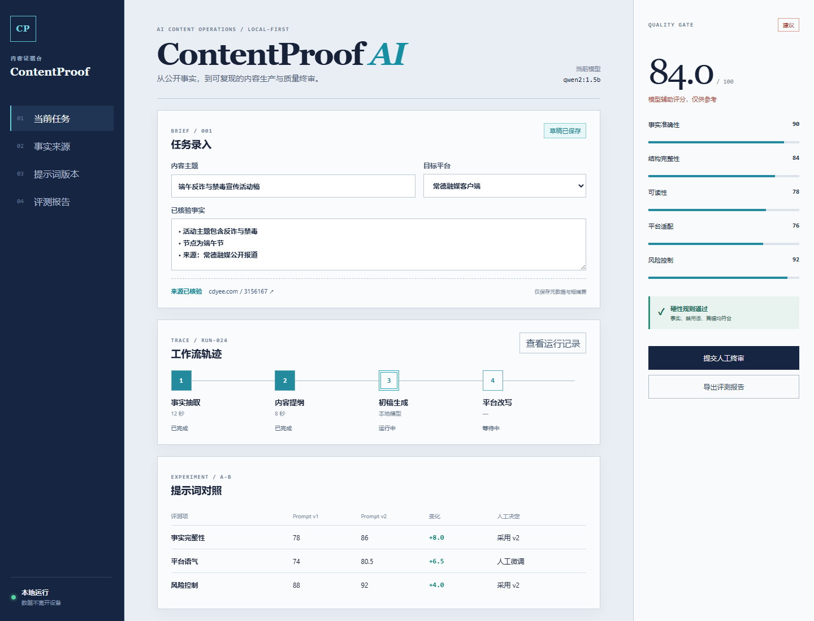
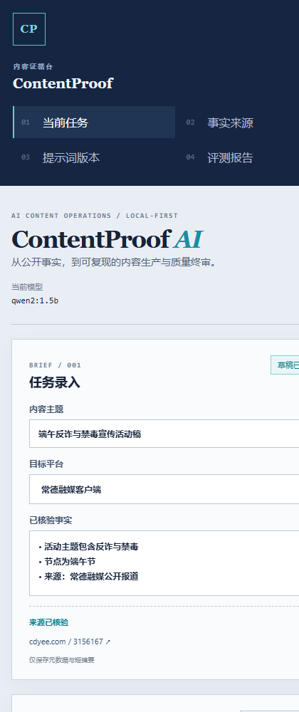

# ContentProof AI

AI 内容生产与质量评测工作台：用来源约束、提示词版本、运行轨迹和人工终审，把内容生成变成可验证实验。

## 项目证据

- 4 篇公开署名作品的元数据与原文链接
- 20 条评测用例，其中 4 条为明确失败案例
- 2 个不可变提示词版本
- 5 维加权质量评分与确定性规则检查
- 可追踪的工作流步骤、人工终审和 Markdown/CSV 导出

模型评分属于辅助意见，最终判断以人工终审为准。

## 本地运行

环境要求：Python 3.11+、Node.js 20+，可选安装 [Ollama](https://ollama.com/)。

```powershell
# 后端
cd backend
python -m venv .venv
.\.venv\Scripts\python.exe -m pip install -e ".[dev]"
cd ..
.\backend\.venv\Scripts\python.exe scripts\seed.py
cd backend
.\.venv\Scripts\python.exe -m uvicorn app.main:app --host 127.0.0.1 --port 8000
```

另开一个终端：

```powershell
cd frontend
npm install
npm run dev
```

打开 `http://127.0.0.1:5173`。API 文档位于 `http://127.0.0.1:8000/docs`。

如需真实本地模型生成，先启动 Ollama，并确认 `ollama list` 至少返回 `qwen2:1.5b` 或其他可用模型。没有 Ollama 时，数据管理、规则评测、报告导出和前端演示仍可独立运行。

## 验证

```powershell
.\backend\.venv\Scripts\python.exe -m pytest backend/tests -q
cd frontend
npm test
npm run build
```

## 数据与版权

仓库仅保存公开元数据、原文链接、短摘要和原创评测标注，不转载新闻全文或原图。页面阅读数据标记为采集日期下的“平台展示累计数”，不等同于独立用户数。

更多资料：

- [系统架构](docs/architecture.md)
- [三分钟演示脚本](docs/demo-script.md)
- [项目复盘](docs/project-retrospective.md)
- [简历项目表述](docs/resume-entry.md)

## 界面预览



桌面视图同时呈现来源约束、四步运行轨迹、提示词对照和人工质量闸门。



移动端将导航、编辑区与质量面板改为纵向排列。
