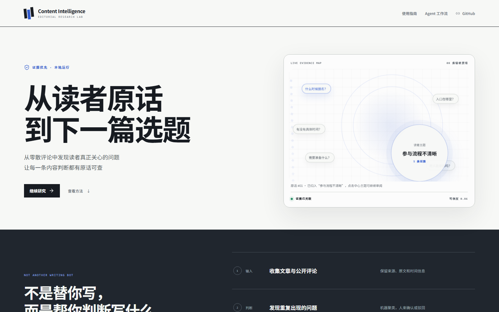
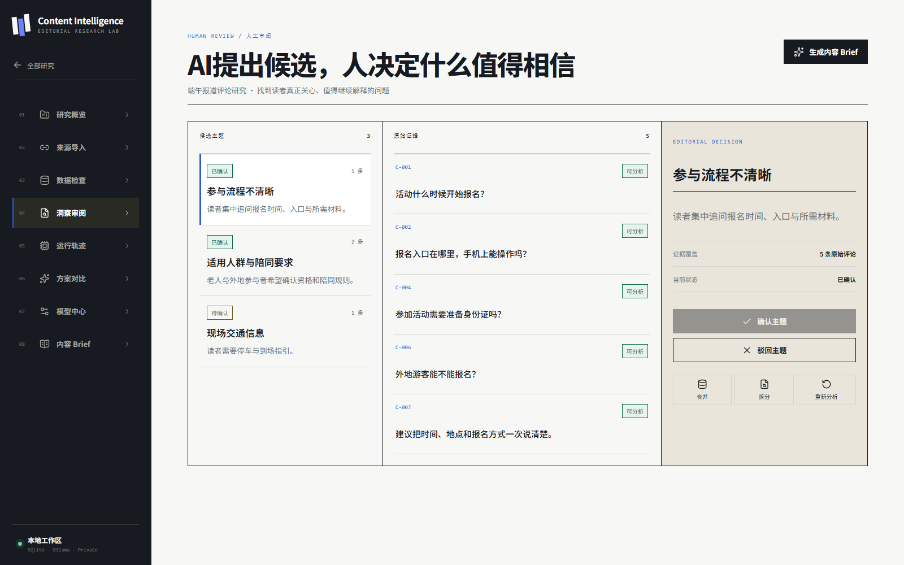
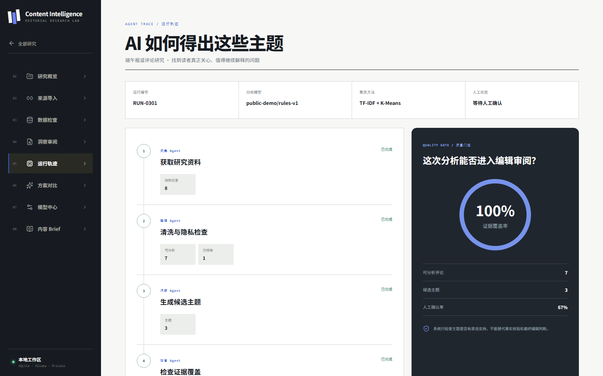
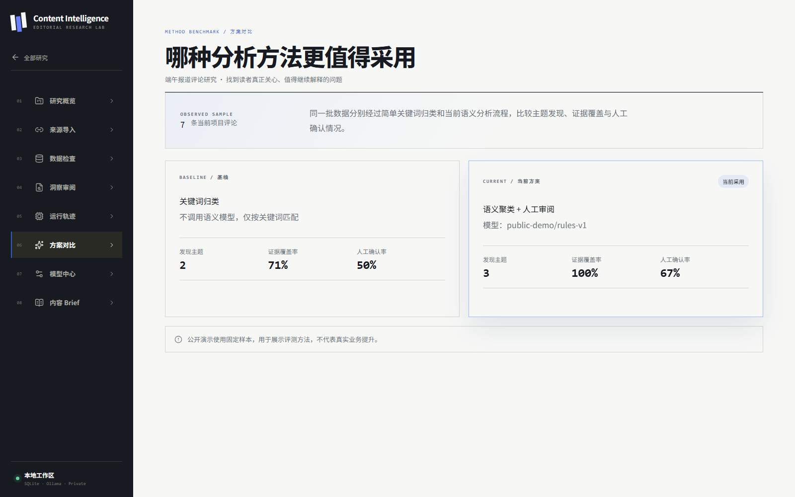
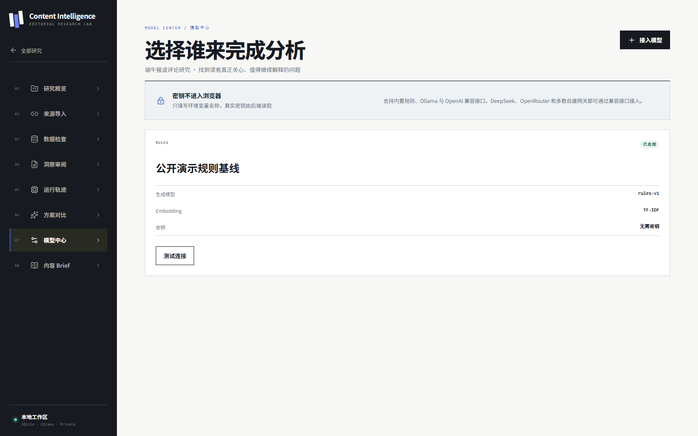
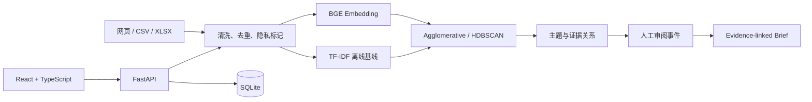

# Content Intelligence Lab

<p align="center">
  <strong>从读者原话，到下一篇选题</strong><br>
  本地优先、证据优先的 AI 内容研究工作台
</p>

<p align="center">
  <a href="https://a2740637809-rgb.github.io/contentproof-ai/"><strong>在线体验</strong></a>
  ·
  <a href="docs/user-guide.md">使用指南</a>
  ·
  <a href="docs/architecture.md">架构说明</a>
  ·
  <a href="docs/evaluation.md">评测方法</a>
</p>

<p align="center">
  
  
  
  
</p>

[](https://a2740637809-rgb.github.io/contentproof-ai/)

## 为什么做它

内容团队并不缺“再写一篇稿”的工具，真正困难的是从大量反馈中判断：**读者反复追问什么、结论依据哪句原话、下一篇内容应该解决什么问题。**

Content Intelligence Lab 把公开文章、评论与用户反馈整理成可审阅的读者主题，再生成每条判断都能返回原文的内容 Brief。它强调证据链和人工决策，不把 AI 总结伪装成事实。

```text
文章 / 评论
  → 清洗、去重与隐私标记
  → Embedding 语义聚类
  → 人工确认、驳回、合并与拆分
  → 带原始评论编号的内容 Brief
  → Markdown / Word 导出
```

## 30 秒看懂产品

| 证据审阅 | Agent 运行轨迹 |
|---|---|
| 每个主题都能回到原始评论，支持人工确认与驳回 | 保存模型、步骤、输入量和证据覆盖率 |
|  |  |

| 同数据方案对比 | 多模型接入 |
|---|---|
| 在同一批评论上比较关键词基线与语义方案 | 内置离线基线，并支持 Ollama 与 OpenAI 兼容接口 |
|  |  |

> 截图来自公开演示站；演示数据为合成数据，仅用于验证产品流程。

## 它与普通 AI 写作 Demo 的区别

| 常见 Demo | Content Intelligence Lab |
|---|---|
| 输入一句话，直接生成答案 | 从真实来源和用户反馈开始研究 |
| AI 给出不可追溯的总结 | 每个主题连接原始评论和来源 |
| 只展示最终结果 | 保存运行步骤、模型信息和审阅事件 |
| 模型离线就无法演示 | TF-IDF 离线基线可继续完成流程 |
| 输出只能复制 | 可编辑 Brief，并导出 Markdown / Word |

## 核心能力

- **真实数据入口**：公开网页、粘贴评论、CSV、XLSX。
- **数据质量控制**：清洗、去重、手机号/邮箱标记、广告排除与人工恢复。
- **语义主题发现**：BGE Embedding + Agglomerative / HDBSCAN 聚类。
- **离线降级**：模型不可用时使用字符 TF-IDF，并明确标记 `offline-fallback`。
- **Human-in-the-loop**：主题确认、驳回、重命名、合并和拆分均会持久化。
- **可复现评测**：运行轨迹、证据覆盖率和同数据方案对比。
- **多模型接入**：规则基线、Ollama、OpenAI 兼容接口；密钥只从后端环境变量读取。
- **可交付输出**：生成带证据编号的内容 Brief，导出 Markdown 与 Word。

## 最快体验

1. 打开[在线演示](https://a2740637809-rgb.github.io/contentproof-ai/)。
2. 点击“加载完整示例”。
3. 依次查看“数据检查”“洞察审阅”“运行轨迹”和“方案对比”。
4. 在“内容 Brief”检查选题、结构和证据编号。

在线版本用于体验完整交互与产品逻辑；网页抓取、本地模型和文件导出等后端能力请使用本地版。

## 技术架构



| 层 | 技术 | 作用 |
|---|---|---|
| 产品界面 | React、TypeScript、Vite、Motion | 研究流程、证据审阅与响应式交互 |
| 数据状态 | TanStack Query、TanStack Table | API 缓存与高密度评论表格 |
| 应用服务 | FastAPI、Pydantic、SQLAlchemy | 类型化 API、业务规则与持久化 |
| AI 分析 | Sentence Transformers、scikit-learn、HDBSCAN | 向量化、聚类与离线降级 |
| 数据处理 | trafilatura、openpyxl、python-docx | 网页/文件导入与 Brief 导出 |

## 本地运行

要求：Python 3.11+、Node.js 20+。首次使用 BGE 模型约需 2 GB 可用空间。

```powershell
# 后端
cd backend
py -3.12 -m pip install -e ".[dev]"
py -3.12 -m uvicorn app.main:app --reload

# 新终端：前端
cd frontend
npm install
npm run dev
```

- 产品界面：`http://localhost:5173`
- API 文档：`http://127.0.0.1:8000/docs`

## 验证

```powershell
cd backend
py -3.12 -m pytest -q

cd ..\frontend
npm test -- --run
npm run build
npm run test:e2e
```

## 真实性与边界

- 演示评论为合成数据，不冒充真实用户调研或业务成绩。
- 网页导入只处理公开可访问内容；平台未开放的评论需要手动导入。
- 评论只能证明“读者提出了什么问题”，不能替代事实核验。
- 本地优先不等于完整企业安全；生产部署仍需认证、权限和密钥管理。
- 项目不宣称未经验证的效率提升或客户案例。

## 项目文档

- [产品规格](docs/superpowers/specs/2026-07-27-content-intelligence-lab-v2-design.md)
- [架构说明](docs/architecture.md)
- [用户指南](docs/user-guide.md)
- [评测方法](docs/evaluation.md)
- [贡献指南](CONTRIBUTING.md)

## Roadmap

- [x] 数据导入、清洗、脱敏、排除与恢复
- [x] BGE Embedding、语义聚类与离线基线
- [x] 主题审阅、运行轨迹、方案对比和多模型接入
- [x] 项目归档、回收站与 Brief 导出
- [ ] 3–5 位内容从业者可用性测试
- [ ] 基于真实授权数据的聚类评测集
- [ ] 多用户认证与项目权限

## License

[MIT](LICENSE) © 张作朋
