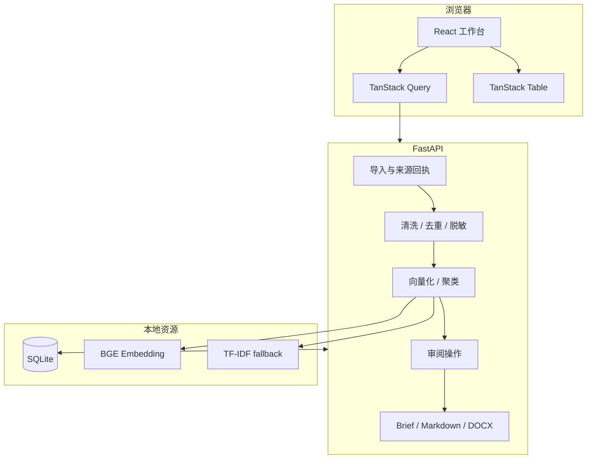

# Content Intelligence Lab 架构说明

## 设计原则

1. **证据先于结论**：主题必须连接原始评论，Brief 必须连接已确认主题。
2. **AI 提议，人做决定**：模型输出默认是 `pending_review`，不能直接进入 Brief。
3. **失败状态显式化**：正文与评论分别报告状态；BGE 不可用时明确标注离线基线。
4. **本地优先**：SQLite、向量计算与导出默认在本机完成，不依赖付费 Token。
5. **保留可追溯过程**：分析运行、主题关系与人工操作分别持久化。

## 系统边界

## 核心实体

| 实体 | 作用 | 关键约束 |
|---|---|---|
| `ResearchProject` | 一次有明确目标的内容研究 | 记录当前阶段 |
| `ResearchSource` | 网页、粘贴或表格来源 | 正文与评论状态分离 |
| `ResearchComment` | 原始评论及清洗结果 | `project_id + content_hash` 去重 |
| `CommentEmbedding` | 评论向量缓存 | `comment_id + model_name` 唯一 |
| `AnalysisRunV2` | 一次分析运行 | 记录模型、聚类方法和状态 |
| `ResearchTheme` | AI 生成的候选主题 | 归属具体分析运行 |
| `ThemeMembership` | 主题与评论的证据关系 | 一条评论可在主题操作中移动 |
| `ReviewEvent` | 确认、驳回、合并、拆分记录 | 保存操作前后数据 |
| `ResearchBrief` | 人工确认后的内容方案 | 项目内版本号唯一 |

## 分析策略

### BGE 路径

`BAAI/bge-small-zh-v1.5` 将评论编码为归一化浮点向量：

- 少于 30 条：层次聚类，便于小样本自动决定簇数；
- 30 条及以上：HDBSCAN，允许把离群评论标记为噪声；
- 向量以 float32 二进制保存，重复分析时更新缓存而不是重复插入。

### 离线路径

如果 BGE 权重尚未下载或模型加载失败：

1. 使用 2–4 字符 n-gram 的 TF-IDF 向量；
2. 继续执行相同聚类接口；
3. 运行记录写入 `tfidf-char-local-fallback`；
4. 聚类方法追加 `offline-fallback`。

离线结果是可工作的低成本基线，不冒充语义模型结果。

## 审阅一致性

- 列表只展示最近一次完成的分析运行；
- 历史运行仍保存在数据库；
- 合并会把来源主题的证据移到目标主题；
- 拆分只移动用户选中的评论；
- 每个操作写入 `ReviewEvent`；
- 只有 `confirmed` 主题可以生成 Brief。

## 当前工程边界

- SQLite 适合单机作品集与小团队原型，不适合多实例并发写入；
- 分析目前在请求线程执行，大数据量应迁移到任务队列；
- 数据表由 SQLAlchemy 启动时创建，生产化需要 Alembic 迁移；
- 未包含账号、项目权限和组织级审计；
- 网页评论受平台公开能力限制，无法绕过登录或反爬限制。
